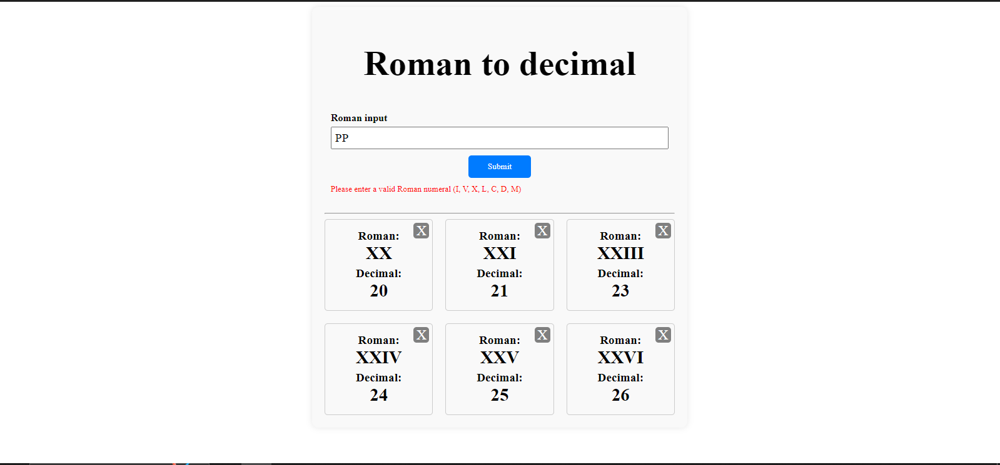

## Roman to Decimal Conversion

This Angular project allows users to convert Roman numerals to decimal numbers. It provides a simple user interface where users can input a Roman numeral, and the app will convert it to its corresponding decimal value. The app also keeps track of previous conversions in a list.

You can see a live preview of the app [here](https://roman-converter-mauve.vercel.app/).

### Features:
- **Conversion Form:** Users can input a Roman numeral in a text field and submit it for conversion.
- **Validation:** The app validates the input to ensure it contains only valid Roman numeral characters (I, V, X, L, C, D, M).
- **Conversion Logic:** Roman numerals are converted to decimal using a custom function that follows the Roman numeral rules.
- **History:** Previous conversions are displayed in a list, showing the Roman numeral input and its corresponding decimal output.
- **Remove Conversion:** Users can remove a conversion from the history list.

### Technologies Used:
- **Angular:** The frontend framework used to build the user interface and handle user interactions.
- **TypeScript:** The programming language used for the Angular components and logic.
- **HTML/CSS:** Used for structuring the UI and styling the components.
- **Angular Forms:** Used for handling form input and validation.

### Usage:
To use the app, simply enter a valid Roman numeral in the input field and click the "Submit" button. The app will convert the numeral to decimal and display it in the history list. You can remove a conversion from the history list by clicking the "X" button on the corresponding card.
